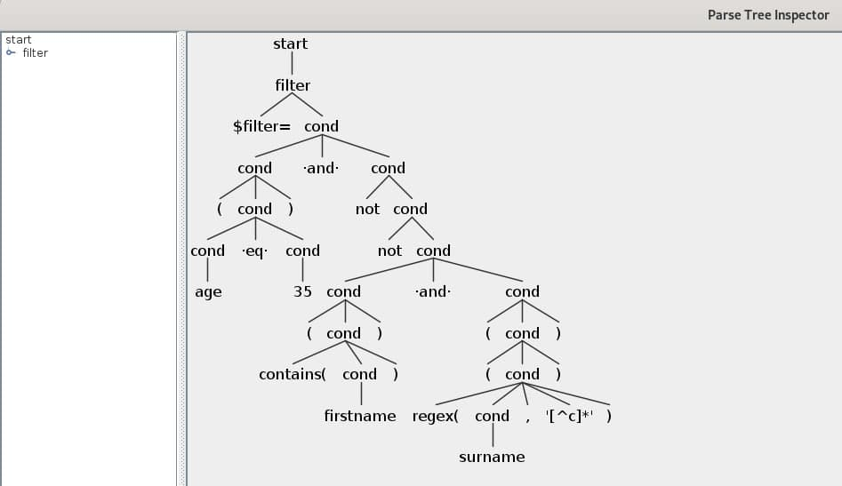

# Eurotech

An application manages access to “resource” objects (e.g a user) and we need to
provide a Java API for querying the set of available resources. 

One of the requirements for the **query API** is to have filtering functionality allowing clients to
select resources which match certain criteria. For the sake of simplicity, a “resource”
is represented using a `Map<String,String>` which maps “property” names (keys) to
their values. 

> Property names are case sensitive, but property values are not.


## Task:

Design and implement a “Filter” API which can be used to determine whether or not
a resource matches a given set of criteria. More specifically, the filter API should
provide the following functionality:

1. The ability to determine whether or not a filter matches a given resource (where a
resource is represented using a `Map<String,String>`).

2. Support for the following types of filter predicate (it is not necessary to implement all
of these):

* boolean literals: true and false
* logical operators which can be used to combine the results of other filters: AND, OR,
and NOT
* comparison operators (care should be taken to deal with missing properties):
* property is present
* property is equal to some value
* property is less than some value
* property is greater than some value
* property matches a regular expression.

3. The ability to programmatically construct arbitrarily complex filters.

4. A string representation, including the ability to generate and parse filters from the
string representation. 

> **IMPORTANT NOTE**: you are not required to implement the
string parsing logic since this could take too long and may prevent you from
completing the rest of this exercise in the provided time.


## Extensibility

Consider how the API could be extended to include support for new types of filter.
Consider how the API could support 3rd party applications which need to perform
some logic based on the structure and content of a filter in a type-safe manner.

## Example usage:

```{java}
// Create user resource having various properties:
Map<String, String> user = new LinkedHashMap<String, String>();
user.put(“firstname”,     “Joe”);
user.put(“surname”,       “Bloggs”);
user.put(“role”,          “administrator”);
user.put(“age”,           “35”);
// Create a filter which matches all administrators older than 30:
IFilter filter = new Filter("$filter=(age ge 30) and (contains(role, administrator))"); // Create a filter using your API.
assert filter.matches(user);      // Filter should match.
user.put(“age”,           “25”);
assert !filter.matches(user);     // Filter should not match.
```

--- 

# Get started

This library was written in Java - [openjdk-16](https://openjdk.java.net/)

```
openjdk 16 2021-03-16
OpenJDK Runtime Environment (build 16+36-2231)
OpenJDK 64-Bit Server VM (build 16+36-2231, mixed mode, sharing)
```

The automated building tool/package manager is [Apache Maven](https://maven.apache.org/)

```
Apache Maven 3.6.3 (cecedd343002696d0abb50b32b541b8a6ba2883f)
Java version: 16, vendor: Oracle Corporation, runtime: jdk-16
Default locale: en_US, platform encoding: UTF-8
OS name: "linux", version: "4.19.0-14-amd64", arch: "amd64", family: "unix"
```

The parser was implemented in [Antlr4](https://www.antlr.org/) using the visitor pattern

```
ANTLR Parser Generator  Version 4.9.2
```

> Download and install the latest versions of open-jdk, antlr4 and maven in order to setup the project


## Clone, Tests and build

Using the following command you will clone the repository, build and run the unit tests

```sh
git clone https://github.com/EdoardoLenzi9/Eurotech.git
cd Eurotech/efilter
mvn package
```

## Extend/update the grammar

In order to extend/update the grammar use this script (this shouldn't work on windows...this is a mok and I'm a winzoz hater!)

```sh
cd scripts
sh compile-grammar.sh
```

In order to test a new grammar and generate the AST type:

```sh
cd scripts
sh test-grammar.sh
$filter=(age eq 35) and not not (contains(firstname)) and ((regex(surname, '[^c]*')))
^D
```




## Usage examples

```java
// Create a filter using your API.
IFilter filter = new Filter("$filter=(age eq 35) and not not (contains(firstname)) and ((regex(surname, '[^c]*')))"); 
// Filter should match.
assertTrue(filter.matches(_user));      
// Update resource
_user.put("age", "25");
// Filter mismatch
assertFalse(filter.matches(_user));
```

For additional examples see `./efilter/src/test/java/com/eurotech/filter/FilterTest.java`

## Folder Tree

```
scripts
efilter
+---antlr4
    +---Filter.g4
+---java
    +---Filter.java
    +---IFilter.java
    +---FilterEvaluator.java
    +---parser
        +---(parser files autogenerated by Antlr4)
```


## Final considerations

### Extensibility

This approach is 100% extensible simply implementing new rules for the grammar and upating consistently the evaluator (`.efilter/src/main/java/com/eurotech/filter/FilterEvaluator.java`).

It is possible and much more interesting working on classes instead of Maps using reflection.

It is also possible to embed this library in a Docker image but this not really useful in this case since this libray has only a Java interface `IFilter` but not a REST API...  